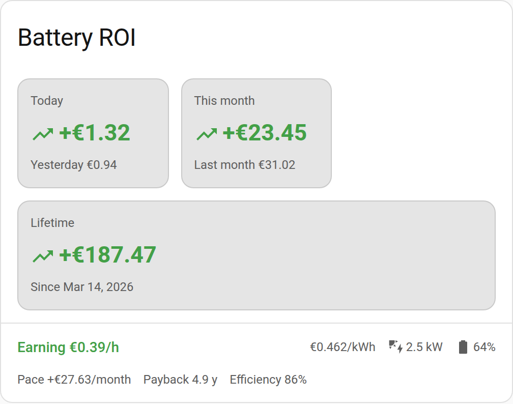
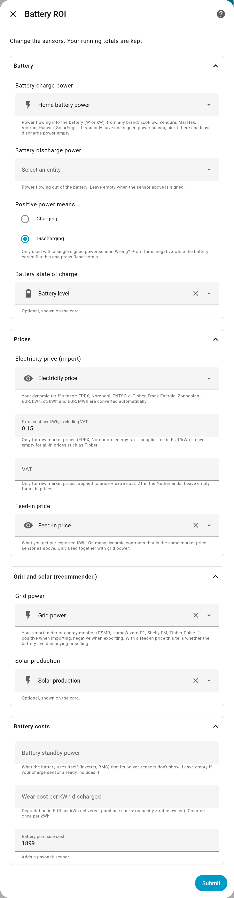
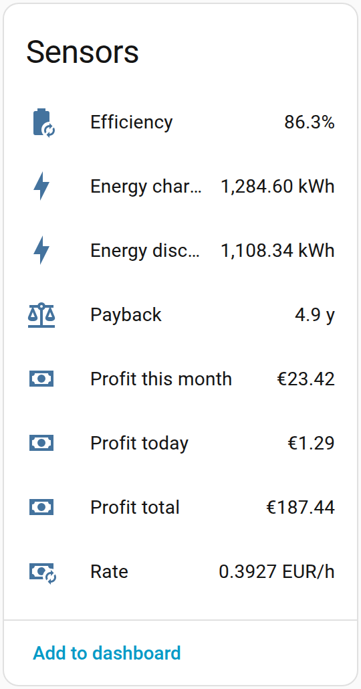
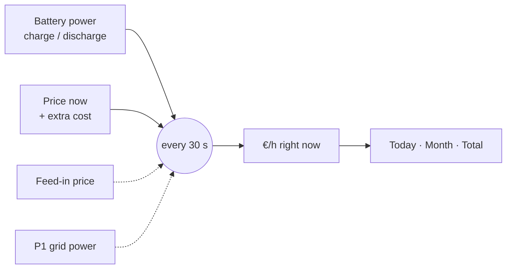

<div align="center">

# 🔋💶 Battery ROI

**How much money did your home battery actually make today?**

A Home Assistant integration that multiplies every kWh your battery charges and discharges by the price at that exact moment, and shows the result as a live profit ticker.

[](https://hacs.xyz/docs/faq/custom_repositories/)
[](https://www.home-assistant.io/)
[](https://github.com/PeterSlijkhuis/Battery-ROI/actions/workflows/ci.yml)


[](https://my.home-assistant.io/redirect/hacs_repository/?owner=PeterSlijkhuis&repository=Battery-ROI&category=integration)
[](https://my.home-assistant.io/redirect/config_flow_start/?domain=battery_roi)

<picture>
  <source media="(prefers-color-scheme: dark)" srcset="docs/card-dark.png">
  
</picture>

</div>

---

## Why

Standard energy dashboards show kWh. With dynamic prices (EPEX, Nordpool, Tibber, Frank Energie, Zonneplan …) the question that matters is money: *did charging at 3 AM and discharging at 7 PM pay off?* Battery ROI answers that per day, per month, and since the day you installed it.

## Features

- 🧮 **Real profit, not an estimate**: every 30 seconds, energy × the price that applied at that moment
- 🖱️ **No YAML**: pick your own sensors in a setup screen, change them later without losing your totals
- 🔌 **Works with what you have**: EcoFlow, HomeWizard P1, any dynamic price sensor, W/kW and EUR/kWh, ct/kWh or EUR/MWh
- ☀️ **Solar aware**: with a feed-in price and a P1 meter, it knows whether a kWh replaced buying or selling
- 📈 **Dashboard card included**: today, this month, yesterday, last month, live €/h, monthly pace, payback and efficiency
- 🎨 **Matches your theme**: the card uses only Home Assistant theme variables, light and dark
- 📴 **Works offline**: the card and its UI library ship inside the integration, no CDN

## Requirements

| What | Why |
| --- | --- |
| Home Assistant **2024.11** or newer | Uses the current config and options flow APIs |
| [HACS](https://hacs.xyz/) | To install and update (manual install also works) |
| A **battery power** sensor | Power into and out of the battery, as two sensors or one signed sensor |
| A **price** sensor | Your dynamic tariff per kWh |
| *Optional:* feed-in price, grid power (P1), solar production, state of charge | Better accuracy and more on the card |

No extra Python packages are installed. The card's only library, [Lit](https://lit.dev), is bundled.

## Installation

### HACS (recommended)

1. Click **Open in HACS** above, or in HACS go to ⋮ → **Custom repositories**, add `https://github.com/PeterSlijkhuis/Battery-ROI` with category **Integration**.
2. Download **Battery ROI** and restart Home Assistant.
3. Click **Add integration** above, or go to **Settings → Devices & services → Add integration → Battery ROI**.

### Manual

Copy `custom_components/battery_roi` into your `<config>/custom_components/` folder and restart Home Assistant.

## Setup

Pick your sensors. Only battery power and price are required.

<picture>
  <source media="(prefers-color-scheme: dark)" srcset="docs/setup-dark.png">
  
</picture>

| Field | Required | Examples |
| --- | :---: | --- |
| Battery charge power | ✅ | EcoFlow input power, or one signed battery power sensor |
| Battery discharge power | | EcoFlow output power. Leave empty when the field above is signed |
| Positive power means | | Charging or discharging, for a signed sensor |
| Electricity price (import) | ✅ | EPEX, Nordpool, ENTSO-e, Tibber, Frank Energie, Zonneplan |
| Extra cost per kWh | | For raw market prices: energy tax + supplier fee + VAT, in EUR/kWh |
| Feed-in price | | What you get per exported kWh |
| Grid power (P1) | | HomeWizard P1 active power, + import / − export |
| Solar production | | Shown on the card |
| Battery state of charge | | Shown on the card |
| Battery standby power | | W the battery uses itself that its power sensors miss (inverter, BMS) |
| Wear cost per kWh discharged | | Degradation, e.g. price ÷ (capacity × rated cycles) |
| Battery purchase cost | | Adds a payback sensor |

To change sensors later: **Settings → Devices & services → Battery ROI → Configure**.

## The card

The integration loads the card for you. Add it to any dashboard:

```yaml
type: custom:battery-roi-card
```

That's all. Every option is optional:

| Option | Default |
| --- | --- |
| `title` | `Battery ROI` |
| `daily` | `sensor.battery_roi_profit_today` |
| `monthly` | `sensor.battery_roi_profit_this_month` |
| `rate` | `sensor.battery_roi_rate` |
| `payback` | `sensor.battery_roi_payback` |
| `efficiency` | `sensor.battery_roi_efficiency` |
| `price`, `soc` | read from the rate sensor |
| `currency` | your Home Assistant currency |

Tap a number to open its history. The **pace** line projects this month's profit to a full month, using the exact time elapsed; it stays hidden on the 1st.

## Sensors

<picture>
  <source media="(prefers-color-scheme: dark)" srcset="docs/sensors-dark.png">
  
</picture>

| Sensor | Meaning |
| --- | --- |
| `sensor.battery_roi_rate` | €/h right now. Positive = earning. Attributes: price, feed-in price, grid kW, solar kW, state of charge |
| `sensor.battery_roi_profit_today` | Profit today, `last_period` = yesterday |
| `sensor.battery_roi_profit_this_month` | Profit this month, `last_period` = last month |
| `sensor.battery_roi_profit_total` | Profit since setup |
| `sensor.battery_roi_energy_charged` | kWh into the battery |
| `sensor.battery_roi_energy_discharged` | kWh out of the battery |
| `sensor.battery_roi_efficiency` | Discharged ÷ charged, shown after 1 kWh |
| `sensor.battery_roi_payback` | Years until the battery has paid for itself at the average rate so far, shown after 7 days |

Totals survive restarts. Gaps longer than 15 minutes (Home Assistant down, sensor offline) are skipped rather than guessed.

<br clear="right">

## How profit is calculated

Profit is **your grid bill without the battery minus your grid bill with it**.



- **Price sensor only.** `profit per hour = (discharge kW − charge kW) × price`. The same price is used in both directions, which is right under net metering (*salderingsregeling*).
- **Plus feed-in price and P1.** Each kWh is valued at the price it actually displaced:

| Battery is… | While the house is… | Valued at |
| --- | --- | --- |
| discharging | importing from the grid | import price (avoided buying) |
| discharging | exporting | feed-in price (extra sold) |
| charging | exporting solar surplus | feed-in price (gave up selling) |
| charging | importing | import price (bought) |

Included: round-trip losses, because you charge more kWh than you get back. Optional: the battery's own standby draw, and wear per kWh discharged (counted once, not on both charge and discharge).

> **Tip for the Netherlands:** net metering ends on 1 January 2027. From then on a stored solar kWh is worth the feed-in price, not the import price, so add a feed-in price and your P1 meter to keep the numbers honest.

> **Tip for raw EPEX prices:** they exclude energy tax and VAT, so fill in *Extra cost per kWh*. VAT is really a percentage, so a flat amount is an approximation.

## FAQ

<details>
<summary><b>Why not just use the battery's state of charge?</b></summary>

State of charge moves in whole percents and hides charging losses, so a 5 kWh battery can hide 50 Wh per step. Power sensors give the real flow.
</details>

<details>
<summary><b>My EcoFlow has one power sensor that goes negative. What do I pick?</b></summary>

Pick it as **Battery charge power**, leave discharge power empty, and set **Positive power means** to whatever your sensor does.
</details>

<details>
<summary><b>The numbers start at zero. Can I import history?</b></summary>

Not yet. Tracking starts when you set up the integration.
</details>

<details>
<summary><b>Can I use my own card?</b></summary>

Yes. All numbers are ordinary sensors, so Mushroom, Tile or any other card works.
</details>

## Development

```bash
pip install -r requirements_test.txt
pytest
```

CI runs Home Assistant's `hassfest` validation and the test suite on every pull request. The screenshots above come from a real Home Assistant 2026.2 with demo sensors.

## Contributing

Issues and pull requests are welcome at [github.com/PeterSlijkhuis/Battery-ROI](https://github.com/PeterSlijkhuis/Battery-ROI/issues).
