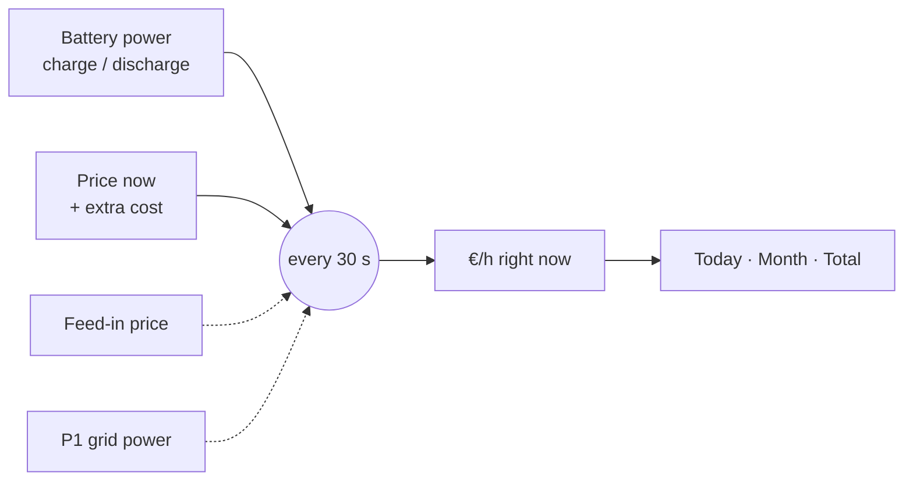

<div align="center">

# 🔋💶 Battery ROI

**How much money did your home battery actually make today?**

A Home Assistant integration that multiplies every kWh your battery charges and discharges by the price at that exact moment, and shows the result as a live profit ticker.

[](https://hacs.xyz/docs/faq/custom_repositories/)
[](https://www.home-assistant.io/)
[](https://github.com/PeterSlijkhuis/Battery-ROI/actions/workflows/ci.yml)

[](LICENSE)

[](https://my.home-assistant.io/redirect/hacs_repository/?owner=PeterSlijkhuis&repository=Battery-ROI&category=integration)
[](https://my.home-assistant.io/redirect/config_flow_start/?domain=battery_roi)

<picture>
  <source media="(prefers-color-scheme: dark)" srcset="docs/card-dark.png">
  
</picture>

**[Setup in 5 steps](#step-by-step-setup)** · [Troubleshooting](#after-setup) · [How profit is calculated](#how-profit-is-calculated)

</div>

---

## Why

Standard energy dashboards show kWh. With dynamic prices (EPEX, Nordpool, Tibber, Frank Energie, Zonneplan …) the question that matters is money: *did charging at 3 AM and discharging at 7 PM pay off?* Battery ROI answers that per day, per month, and since the day you installed it.

## Features

- 🧮 **Real profit, not an estimate**: every 30 seconds, energy × the price that applied at that moment
- 🖱️ **No YAML**: pick your own sensors in a setup screen, change them later without losing your totals
- 🔌 **Works with what you have**: EcoFlow, HomeWizard P1, any dynamic price sensor, W/kW and EUR/kWh, ct/kWh or EUR/MWh
- ☀️ **Solar aware**: with a feed-in price and a P1 meter, it knows whether a kWh replaced buying or selling
- 📈 **Dashboard card included**: today, this month, yesterday, last month, live €/h, monthly pace, payback and efficiency
- 🎨 **Matches your theme**: the card uses only Home Assistant theme variables, light and dark
- 🇳🇱 **English and Dutch**: setup screen and card follow your Home Assistant language
- ✏️ **Visual card editor**: no YAML needed on the dashboard either
- 📴 **Works offline**: the card and its UI library ship inside the integration, no CDN

## Requirements

| What | Why |
| --- | --- |
| Home Assistant **2024.11** or newer | Uses the current config and options flow APIs |
| [HACS](https://hacs.xyz/) | To install and update (manual install also works) |
| A **battery power** sensor | Power into and out of the battery, as two sensors or one signed sensor |
| A **price** sensor | Your dynamic tariff per kWh |
| *Optional:* feed-in price, grid power (P1), solar production, state of charge | Better accuracy and more on the card |

No extra Python packages are installed. The card's only library, [Lit](https://lit.dev), is bundled.

## Step-by-step setup

Five steps, about 10 minutes. Every step says exactly where to click in Home Assistant.

> **Before you start:** you need [HACS](https://hacs.xyz/docs/use/) installed, and your battery and price sensors must already exist in Home Assistant (for example from the EcoFlow, HomeWizard, Tibber or Nordpool integrations).

### Step 1 · Find your sensors

Write down the names of the sensors you'll pick in step 4.

1. Go to **Settings → Devices & services → Entities** (tab at the top).
2. Type in the search box to find each one:

| You need | Search for | What it looks like |
| --- | --- | --- |
| Battery charge power *(required)* | `ecoflow` + `power` | Watts that go **into** the battery. Some batteries have one sensor that is positive while charging and negative while discharging; that's fine |
| Battery discharge power | `ecoflow` + `power` | Watts that come **out of** the battery. Skip if the sensor above is signed |
| Electricity price *(required)* | `price`, `tibber`, `nordpool`, `epex` | Your current price per kWh |
| Grid power *(recommended)* | `p1` + `power` | HomeWizard P1: watts from (+) or to (−) the grid |
| Feed-in price *(recommended)* | `price` | What you get per exported kWh. With a dynamic contract this is often the same price sensor |
| Solar production | `solar`, `envoy`, `inverter` | Watts your panels produce right now |
| Battery level | `ecoflow` + `level`, `soc` | Battery % |

> **Not sure which way a signed sensor goes?** Open it (click the name) while the battery is charging. Positive number = "positive means charging".

### Step 2 · Install Battery ROI with HACS

[](https://my.home-assistant.io/redirect/hacs_repository/?owner=PeterSlijkhuis&repository=Battery-ROI&category=integration)

Click the button above and choose your Home Assistant, **or** do it by hand:

1. Open **HACS** in the sidebar.
2. Click **⋮** (top right) → **Custom repositories**.
3. Paste `https://github.com/PeterSlijkhuis/Battery-ROI`, pick type **Integration**, click **Add**.
4. Search HACS for **Battery ROI**, open it, click **Download** (bottom right) → **Download**.

<details>
<summary>No HACS? Install by hand</summary>

Copy the folder `custom_components/battery_roi` from this repository into `/config/custom_components/` on your Home Assistant (for example with the *File editor* or *Samba* add-on), so you end up with `/config/custom_components/battery_roi/manifest.json`.
</details>

### Step 3 · Restart Home Assistant

1. Go to **Settings → System**.
2. Click the **power icon** (top right) → **Restart Home Assistant** → **Restart**.
3. Wait until Home Assistant is back (about a minute), then **refresh your browser** (Ctrl+F5 / pull down on mobile) so the card loads.

### Step 4 · Add the integration and pick your sensors

[](https://my.home-assistant.io/redirect/config_flow_start/?domain=battery_roi)

Click the button above, **or**:

1. Go to **Settings → Devices & services**.
2. Click **+ Add integration** (bottom right).
3. Search for **Battery ROI** and click it.
4. Fill in the form with the sensors from step 1. Only the two fields marked required are needed; open the folded sections for more accuracy.
5. Click **Submit**.

<picture>
  <source media="(prefers-color-scheme: dark)" srcset="docs/setup-dark.png">
  
</picture>

All fields explained:

| Section | Field | Required | What to enter |
| --- | --- | :---: | --- |
| Battery | Charge power | ✅ | Power into the battery, or one signed battery power sensor |
| | Discharge power | | Power out of the battery. Leave empty when the field above is signed |
| | Positive power means | | Only for a signed sensor: does positive mean charging or discharging? |
| | State of charge | | Battery %, shown on the card |
| Prices | Electricity price (import) | ✅ | EPEX, Nordpool, ENTSO-e, Tibber, Frank Energie, Zonneplan… |
| | Extra cost per kWh, excl. VAT | | **Only for raw market prices** (EPEX, Nordpool): energy tax + supplier fee in EUR/kWh |
| | VAT % | | **Only for raw market prices**: 21 in the Netherlands |
| | Feed-in price | | What you get per exported kWh |
| Grid and solar | Grid power (P1) | | HomeWizard P1 active power, + import / − export |
| | Solar production | | Shown on the card |
| Battery costs | Standby power | | Watts the battery uses itself that its power sensors miss |
| | Wear cost per kWh discharged | | Purchase price ÷ (capacity in kWh × rated cycles) |
| | Purchase cost | | What the battery cost you; adds a payback sensor |

> **Tibber, Frank Energie, Zonneplan** sensors already include tax and VAT: leave *Extra cost* and *VAT* empty.

### Step 5 · Put the card on your dashboard

1. Open the dashboard where you want the card.
2. Click the **pencil** (top right) to edit. On a brand-new dashboard you may first need **⋮ → Take control**.
3. Click **+ Add card**, search for **Battery ROI**, and click it.
4. Click **Save**. Done.

Prefer YAML? Add a **Manual** card with:

```yaml
type: custom:battery-roi-card
```

The numbers start at €0 and grow from the moment you finish step 4.

## After setup

| I want to… | Where |
| --- | --- |
| Change which sensors are used | **Settings → Devices & services → Battery ROI → Configure** (your totals are kept) |
| Start the totals from zero | **Settings → Devices & services → Battery ROI → device → Reset totals → Press** |
| See all Battery ROI numbers | **Settings → Devices & services → Battery ROI → device** |
| See a number's history | Tap it on the card |
| Change what the card shows | Edit the dashboard → click the card → **Edit** |
| Update to a new version | **HACS → Battery ROI → ⋮ → Redownload**, then restart (step 3) |

**Numbers look wrong?**

- *Profit goes down while the battery clearly earns money* → the sign is flipped. Change **Positive power means** (step 4 via Configure), or check your P1 sensor, then **Reset totals**.
- *Profit is far too small or large* → check the price sensor's unit (EUR/kWh, ct/kWh and EUR/MWh are handled) and that *Extra cost* is only filled in for raw market prices.
- *Card says Battery ROI isn't set up* → finish step 4, then refresh the browser.
- *Card doesn't appear in the card list* → refresh the browser (Ctrl+F5); on the phone app, close and reopen it.

### Card options

The visual editor covers everything. For YAML, all keys are optional:

| Option | Default |
| --- | --- |
| `title` | `Battery ROI` |
| `daily` | `sensor.battery_roi_profit_today` |
| `monthly` | `sensor.battery_roi_profit_this_month` |
| `rate` | `sensor.battery_roi_rate` |
| `payback` | `sensor.battery_roi_payback` |
| `efficiency` | `sensor.battery_roi_efficiency` |
| `price`, `soc` | read from the rate sensor |
| `currency` | your Home Assistant currency |

The **pace** line projects this month's profit to a full month, using the exact time elapsed; it stays hidden on the 1st.

## Sensors

<picture>
  <source media="(prefers-color-scheme: dark)" srcset="docs/sensors-dark.png">
  
</picture>

| Sensor | Meaning |
| --- | --- |
| `sensor.battery_roi_rate` | €/h right now. Positive = earning. Attributes: price, feed-in price, grid kW, solar kW, state of charge |
| `sensor.battery_roi_profit_today` | Profit today, `last_period` = yesterday |
| `sensor.battery_roi_profit_this_month` | Profit this month, `last_period` = last month |
| `sensor.battery_roi_profit_total` | Profit since setup |
| `sensor.battery_roi_energy_charged` | kWh into the battery |
| `sensor.battery_roi_energy_discharged` | kWh out of the battery |
| `sensor.battery_roi_efficiency` | Discharged ÷ charged, shown after 1 kWh |
| `sensor.battery_roi_payback` | Years until the battery has paid for itself at the average rate so far, shown after 7 days |
| `button.battery_roi_reset_totals` | Start all totals from zero |

Totals survive restarts. Gaps longer than 15 minutes (Home Assistant down, sensor offline) are skipped rather than guessed.

<br clear="right">

## How profit is calculated

Profit is **your grid bill without the battery minus your grid bill with it**.



- **Price sensor only.** `profit per hour = (discharge kW − charge kW) × price`. The same price is used in both directions, which is right under net metering (*salderingsregeling*).
- **Plus feed-in price and P1.** Each kWh is valued at the price it actually displaced:

| Battery is… | While the house is… | Valued at |
| --- | --- | --- |
| discharging | importing from the grid | import price (avoided buying) |
| discharging | exporting | feed-in price (extra sold) |
| charging | exporting solar surplus | feed-in price (gave up selling) |
| charging | importing | import price (bought) |

Included: round-trip losses, because you charge more kWh than you get back. Optional: the battery's own standby draw, and wear per kWh discharged (counted once, not on both charge and discharge).

> **Tip for the Netherlands:** net metering ends on 1 January 2027. From then on a stored solar kWh is worth the feed-in price, not the import price, so add a feed-in price and your P1 meter to keep the numbers honest.

> **Tip for raw EPEX prices:** they exclude energy tax, supplier fee and VAT. Fill in *Extra cost per kWh* and *VAT*: the import price becomes (market price + extra cost) × (1 + VAT).

## FAQ

<details>
<summary><b>Why not just use the battery's state of charge?</b></summary>

State of charge moves in whole percents and hides charging losses, so a 5 kWh battery can hide 50 Wh per step. Power sensors give the real flow.
</details>

<details>
<summary><b>The numbers start at zero. Can I import history?</b></summary>

Not yet. Tracking starts when you set up the integration.
</details>

<details>
<summary><b>Can I use my own card?</b></summary>

Yes. All numbers are ordinary sensors, so Mushroom, Tile or any other card works.
</details>

## Development

```bash
pip install -r requirements_test.txt
pytest
```

CI runs Home Assistant's `hassfest` validation and the test suite on every pull request. The screenshots above come from a real Home Assistant 2026.2 with demo sensors.

## License

[MIT](LICENSE)

## Contributing

Issues and pull requests are welcome at [github.com/PeterSlijkhuis/Battery-ROI](https://github.com/PeterSlijkhuis/Battery-ROI/issues).
