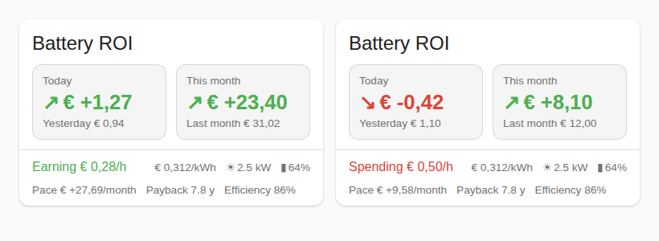

# Battery ROI

A Home Assistant integration that shows how much money your home battery made today and this month by charging when power was cheap and discharging when it was expensive. Everyone picks their own sensors in a setup screen; no YAML.



## Install with HACS

1. HACS → ⋮ → Custom repositories → add `https://github.com/PeterSlijkhuis/Battery-ROI`, category **Integration**.
2. Install **Battery ROI** and restart Home Assistant.
3. Settings → Devices & services → Add integration → **Battery ROI**, and pick your sensors.
4. Add the card to a dashboard: `type: custom:battery-roi-card`. The integration loads the card for you; no resource to add.

Change sensors later with **Configure** on the integration. Your running totals are kept.

## The setup screen

| Field | Required | Examples |
| --- | --- | --- |
| Battery charge power | yes | EcoFlow input power, or one signed battery power sensor |
| Battery discharge power | no | EcoFlow output power. Leave empty if the field above is signed |
| Electricity price (import) | yes | EPEX, Nordpool, ENTSO-e, Tibber, Frank Energie, Zonneplan. EUR/kWh, ct/kWh and EUR/MWh are converted |
| Extra cost per kWh | no | For raw EPEX prices: energy tax + supplier fee + VAT, in EUR/kWh |
| Feed-in price | no | What you get per exported kWh |
| Grid power (P1) | no | HomeWizard P1 active power, + import / − export |
| Solar production | no | Shown on the card |
| Battery state of charge | no | Shown on the card |
| Battery purchase cost | no | Adds a payback sensor |

## What "profit" means

Profit is your grid bill without the battery minus your grid bill with it, added up every 30 seconds.

- With only a price sensor, that is `(discharge kW − charge kW) × price`: the same price both ways.
- With a feed-in price **and** a P1 sensor, each kWh is valued at the price it actually displaced. Discharging into the house avoids buying (import price); discharging while exporting earns the feed-in price; charging from solar surplus costs the feed-in price you gave up; charging from the grid costs the import price.

Battery wear is not counted. Round-trip losses are, because you charge more kWh than you get back.

## Sensors

`sensor.battery_roi_rate` (EUR/h right now, with price, solar and state of charge as attributes), `profit_today` and `profit_this_month` (previous period in `last_period`), `profit_total`, `energy_charged`, `energy_discharged`, `efficiency`, and `payback` when a battery cost is set.

## Card options

All optional: `title`, `daily`, `monthly`, `rate`, `payback`, `efficiency`, `soc`, `price`, `currency`. Defaults point at the integration's own sensors. The card uses only Home Assistant theme variables, so it follows your theme and dark mode.

## Development

```
pip install -r requirements_test.txt
pytest
```
